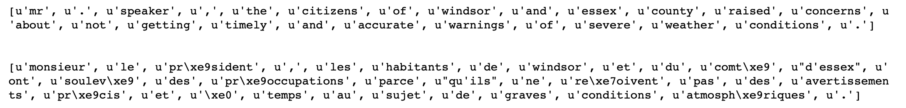
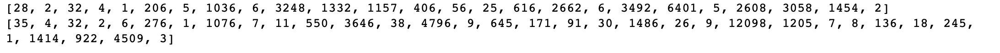
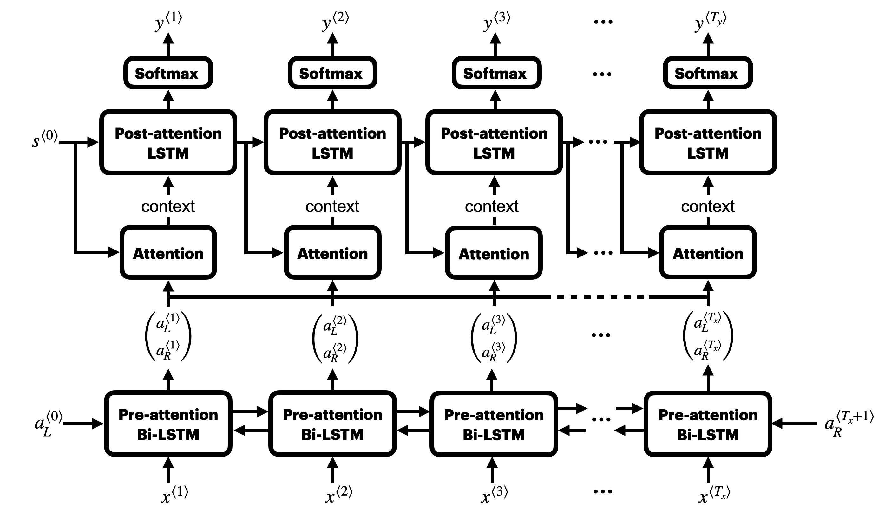
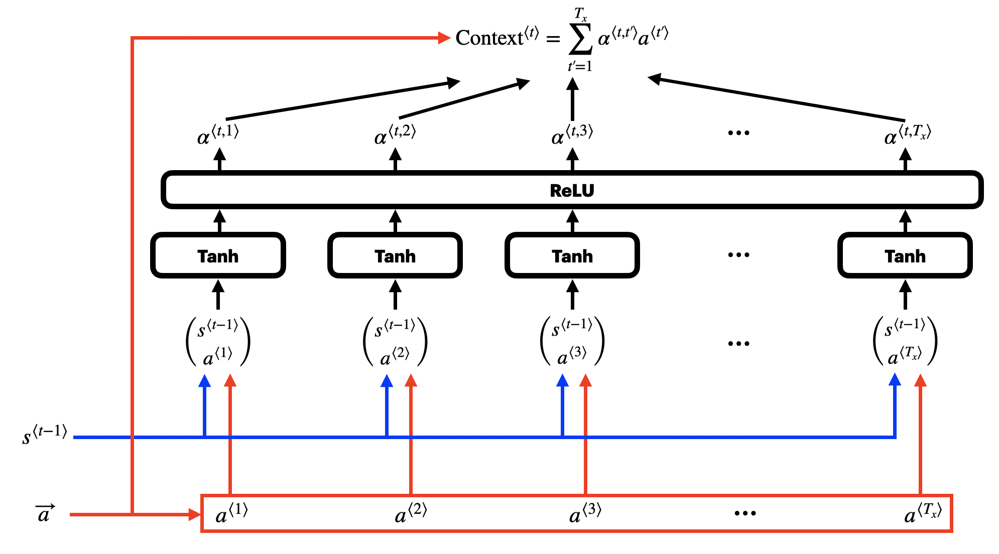
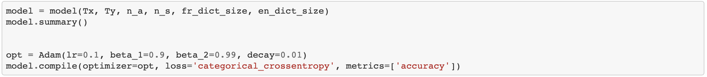
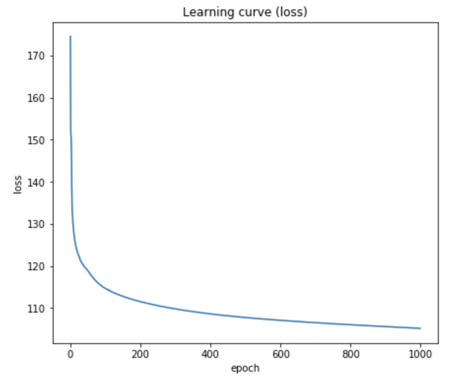
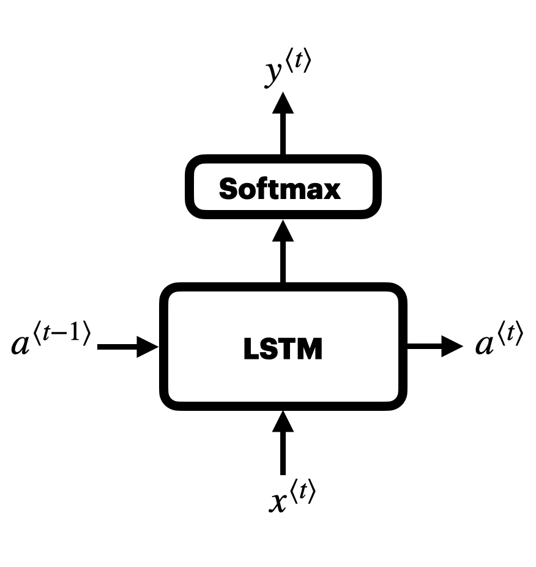
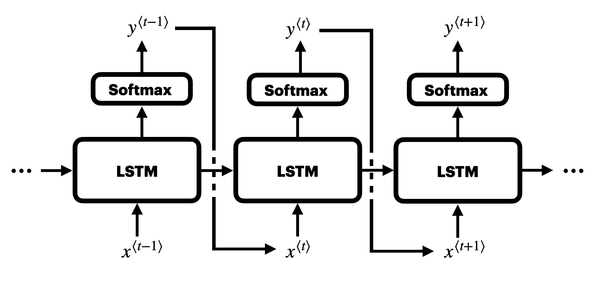
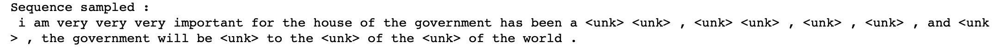

# RNN_keras
A recurrent neural network for natural language processing and sequence generation using Keras framework.
We thanks **deeplearning.ai** for inspiring the program.

In this program, we carry out two tasks with Recurrent Neural Network (RNN): 1.) translate French sentences to English sentences; 2.) generate original English sentences by sequence sampling.

In the first part, we use RNN with attention to translate French to English. We shows the two versions of the same sentence, both in words representation and indices representation.

This is the RNN model we train to translate sentences, with long-short term memory (LSTM) cell as the building blocks. First, the French sentence is decoded with a bidirectional LSTM. We pass the sequence output to attention blocks. The attention blocks allow an output sequence of length (Ty) different from that of the input sequence (Tx), and also each output word in the sequence has attention over the whole input sequence. Note that each input to the attention layer is distributed across all attention cells. The output sequence is encoded by a (unidirectional) LSTM with the contents of the attention blocks as the local input sequence.

In the following figure we also shows the structure of the attention block. Basically it is a layer of neurons discconected in the input time steps, and another layer of neurons fully-connected in the input time steps. The output activations become the weights for the words in the input sequence on the output sequence.

Once again, we train the model using Adam optimizer. In the sample file, we did not train the parameters to the model full potential to save the computation time, i.e. the loss is still steadily dropping towards the final epoch. 

On the second part of this file, 

